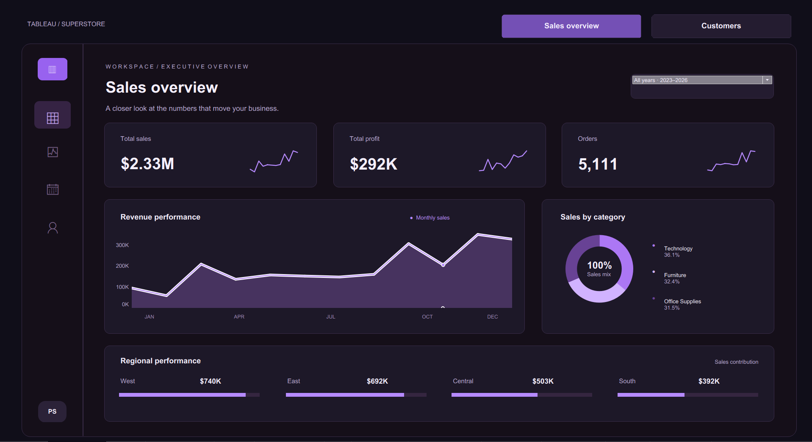
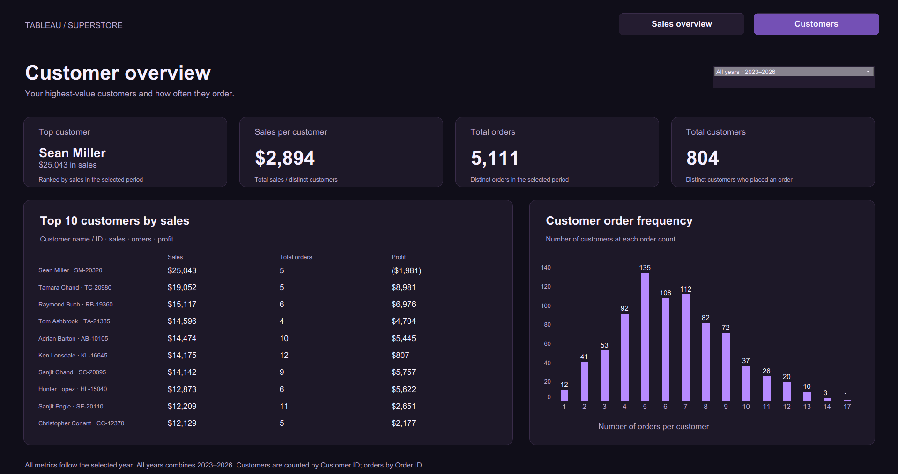

# 🛍️ Superstore Sales Analysis

### 📊 End-to-End Data Analytics Project | SQL • Python • Tableau

An end-to-end data analytics project using **Python, PostgreSQL, and Tableau** to explore retail sales, identify profitability gaps, and uncover business insights.

## 📌 Project Overview

The analysis focuses on three business questions:

- Which products, regions, and customers contribute most to profitability?
- Where do strong sales hide low margins or losses?
- How do discount levels and seasonal patterns relate to business performance?

## 📊 Tableau Dashboards

### 📈 Sales Overview

Sales, profit, orders, monthly sales patterns, category contribution, and regional performance.



### 👥 Customer Overview

Customer count, sales per customer, top customers, and order frequency.



Both dashboards support year filtering. The screenshots show the combined 2023–2026 period.

[📥 Download the Tableau workbook](dashboard/superstore_dashboard.twb)

## 📑 Dataset and Key Metrics

The project uses the Superstore sample retail dataset in [`data/superstore.xlsx`](data/superstore.xlsx), containing three worksheets: **Orders, People, and Returns**.

| Dataset detail | Value |
|---|---|
| Period represented | January 2023–December 2026 |
| Sales line items | 10,194 |
| Unique orders | 5,111 |
| Unique customers | 804 |

| Business metric | Value |
|---|---:|
| Total sales | $2,326,534 |
| Total profit | $292,297 |
| Profit margin | 12.56% |
| Average order value | $455.20 |
| Sales per customer | $2,893.70 |

Each row in Orders represents a sales line item. Orders and customers are counted using distinct Order IDs and Customer IDs. Profit margin is total profit divided by total sales.

The dates represent the supplied sample dataset, not current business results.

## 💡 Business Insights

- **Technology contributed the most profit**, generating **36.1% of sales and 50.1% of total profit**. Copiers alone delivered **$56.1K in profit at a 37.2% margin**.

- **Furniture delivered strong sales but limited profitability**, contributing **32.4% of revenue and only 6.8% of profit**, with a **2.6% margin**. Tables recorded a **$17.8K loss**.

- **Deep discounts were associated with substantial losses**: sales lines discounted above **20%** collectively recorded a **$136.0K loss on $364.8K in revenue**.

- **Regional profitability varied considerably**: West led with **$739.8K in sales and a 15.0% margin**, while Central generated **$503.2K in sales but only a 7.9% margin**.

- **Sales consistently peaked in the fourth quarter**, which was the highest-sales quarter in every dataset year and contributed **38.3% of total revenue**.

- **High customer spending did not guarantee profitability**: Sean Miller generated **$25.0K in sales but a $2.0K loss**, while Tamara Chand generated **$19.1K in sales and $9.0K in profit**.

## 🛠️ Tools and Methods

| Tool | Application |
|---|---|
| 🐍 Python | Exploratory analysis using Pandas, NumPy, Matplotlib, and Seaborn |
| 🗄️ PostgreSQL | Business analysis using aggregations, joins, CTEs, and window functions |
| 📊 Tableau | Interactive sales and customer dashboards |
| 📑 Excel | Source workbook containing Orders, People, and Returns |

The notebook examines missing values, duplicates, distributions, outliers, sales trends, and relationships between business variables.

The SQL scripts cover sales, profitability, categories, geography, customers, products, discounts, shipping, and returns.

## 📂 Repository Structure

```text
superstore-sales-analysis/
├── data/
│   └── superstore.xlsx
├── notebooks/
│   └── superstore_eda.ipynb
├── sql/
│   └── SQL scripts organized by business topic
├── dashboard/
│   └── superstore_dashboard.twb
├── screenshots/
│   ├── customer_dashboard_screenshot.png
│   └── sales_dashboard_screenshot.png
└── README.md
```

## 🚀 How to Reproduce

1. Clone or download this repository.
2. Install the Python dependencies:

   ```bash
   pip install pandas numpy matplotlib seaborn jupyter openpyxl sqlalchemy psycopg2-binary
   ```

3. Open `notebooks/superstore_eda.ipynb`. When running from the notebooks directory, set:

   ```python
   FILE = "../data/superstore.xlsx"
   ```

4. Run the exploratory analysis cells.
5. Create a PostgreSQL database and configure the notebook’s connection for your environment. Review the export cells before running them: they replace existing `orders`, `people`, and `returns` tables.
6. Execute the SQL scripts against the loaded tables.
7. Open `dashboard/superstore_dashboard.twb` in Tableau and reconnect its data source to the supplied workbook.

## 📝 Interpretation Notes

- Findings describe patterns in sample data; they do not establish causation.
- With all years selected, the monthly sales chart combines the same calendar month across years.
- Existing return-rate calculations measure the share of sales lines associated with returned orders, not the percentage of distinct orders returned.
